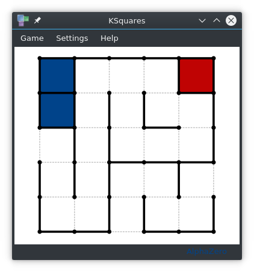

# KSquares
KSquares is an implementation of the game [squares](http://en.wikipedia.org/wiki/Dots_and_Boxes)



## AI opponents

### Easy

Rule based ai. Knows not to give away boxes, chooses chains at random.

### Medium

Rule based ai. Like Easy, but opens shortest chain first.

### Hard 

Rule based ai. Like Medium, but is able to do Double Dealing to keep the
game under control.

### Very Hard

Alpha-Beta search algorithm.

### Dabble

Alpha-Beta search algorithm in a windows application that is run with wine.

### QDab

MCTS with neural network. Can only play on 5x5 boards.

### Knox

Alpha-Beta serach algorithm. Slightly unstable. Executed with wine.

### MCTS A,B,C

Monte-Carlo Tree Search algorithm which uses Easy (A), Medium (B) or Hard (C) AI 
for the simulation step.

### ConvNet

Interface for direct play of various neural networks. You can select the 
network with the `AlphaDots model` drop down list. 

### MCTS ConvNet

Like MCTS A,B,C but uses ConvNet for simulation.

You can find the code in `src/aiConvNet.[h|cpp]`.

### AlphaZero

MCTS as described in the paper about [AlphaZero](https://arxiv.org/abs/1712.01815)

Relevant code files:

```
src/aiAlphaZeroMCTS.[h|cpp]
src/AlphaZeroMCTSNode.[h|cpp]
```

There is a test suite called `alphazero` that tests if the MCTS actually finds
new smart moves that the network would not have made.

This AI offers the following hyperparameters:

* `--hp-mcts-iterations` number of MCTS iterations. The default value is 1500
* `--hp-mcts-cpuct` the C_puct value which controls exploration vs. 
  exploitation. The default value is 10.0
* `--hp-mcts-dirichlet-alpha` the alpha parameter for the dirichlet noise that
  is applied to the children of the MCTS root node. Default: 0.03

## [Tests](Tests.html)

You can run various test suites with `CMAKE_BUILD_DIR/test/ksquarestest`. Call
`ksquarestest` without arguments to execute all available test suites. You
can select individual test suites by passing their name as arguments. For example:

```
ksquarestest hardai berlekamp
```

Each test suite is based on [QTest](https://doc.qt.io/qt-5.10/qtest-overview.html)
Options after `--` are passed to QTest. The following example will
list all tests in the `hardai` test suite.

```
ksquarestest hardai -- -functions
```

The test suites are:

* `berlekamp`
* `hardai`
* `aiboard`
* `alphazero`
* `GSLTest`
* `SharedPointer`

For more details take a look at the [tests page](Tests.html).
