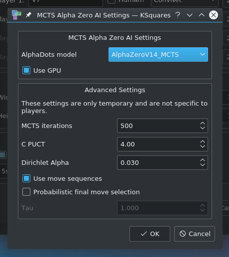

# KSquares
KSquares is an implementation of the game [squares](http://en.wikipedia.org/wiki/Dots_and_Boxes)


## AI opponents

### Easy

Rule based ai. Knows not to give away boxes, chooses chains at random.

### Medium

Rule based ai. Like Easy, but opens shortest chain first.

### Hard 

Rule based ai. Like Medium, but is able to do Double Dealing to keep the
game under control.

### Very Hard

Alpha-Beta search algorithm.

### Dabble

Alpha-Beta search algorithm in a windows application that is run with wine.

### QDab

MCTS with neural network. Can only play on 5x5 boards.

### Knox

Alpha-Beta serach algorithm. Slightly unstable. Executed with wine.

### MCTS A,B,C

Monte-Carlo Tree Search algorithm which uses Easy (A), Medium (B) or Hard (C) AI 
for the simulation step.

### ConvNet

Interface for direct play against various neural networks. In the AI configuration
dialog, you can select the network with the `AlphaDots model` drop down list. 

### MCTS ConvNet

Like MCTS A,B,C but uses ConvNet for simulation.

You can find the code in `src/aiConvNet.[h|cpp]`.

### AlphaZero

MCTS as described in the paper about [AlphaZero](https://arxiv.org/abs/1712.01815)

Relevant code files:

```
src/aiAlphaZeroMCTS.[h|cpp]
src/AlphaZeroMCTSNode.[h|cpp]
```

There is a test suite called `alphazero` that tests if the MCTS actually finds
new smart moves that the network would not have made.

This AI offers the following hyperparameters and configuration options:

* `--hp-mcts-iterations INT` number of MCTS iterations. The default value is 1500
* `--hp-mcts-cpuct FLOAT` the C_puct value which controls exploration vs. 
  exploitation. The default value is 10.0
* `--hp-mcts-dirichlet-alpha FLOAT` the alpha parameter for the dirichlet noise that
  is applied to the children of the MCTS root node. Default: 0.03
* `--hp-mcts-no-move-sequences` when this flag is set, the AI will not use move 
  sequences but only single lines for each node in the Monte-Carlo tree.
  A move sequence can contain more than one line and represents a full move
  by a player. For example: In a situation where a player can capture a chain, the 
  algorithm will generate a sequence where it does Double-Dealing on the chain and 
  it will also generate other sequences where it fully captures the chain and then
  draws another available line. Move sequences reduce the search space by using
  knowledge specific to Dots and Boxes. Settings this flag will disable the use of
  this knowledge.
* `--hp-mcts-use-probabilistic-final-move-selection` enables probabilistic final
  move selection instead of always selecting the highest rated move. MCTS generates
  a probability distribution over all direct children of the root node. Usually, 
  the move with the highest probability is selected, ignoring the other moves with
  lower probabilities. By setting this flag, a decision is made according to the 
  generated probability distribution.
* `--hp-mcts-tau FLOAT` controls the probability distribution when selecting the
  final move. Defaults to 1. For lower values than 1.0 the distribution favors
  moves with higher probability while for values greater than 1.0 the probabilities
  equalize. Tau is only used when `--hp-mcts-use-probabilistic-final-move-selection`
  is active.
* `--hp-mcts-use-think-time` configures the algorithm to honor the think time. By
  default, the MCTS algorithm is only limited by the number of iterations. When set
  to use think times, it will still be limited by the number of iterations.
  
You can also set most hyperparameters in the GUI:



## [Tests](Tests.html)

You can run various test suites with `CMAKE_BUILD_DIR/test/ksquarestest`. Call
`ksquarestest` without arguments to execute all available test suites. You
can select individual test suites by passing their name as arguments. For example:

```
ksquarestest hardai berlekamp
```

Each test suite is based on [QTest](https://doc.qt.io/qt-5.10/qtest-overview.html)
Options after `--` are passed to QTest. The following example will
list all tests in the `hardai` test suite.

```
ksquarestest hardai -- -functions
```

The test suites are:

* `berlekamp`
* `hardai`
* `aiboard`
* `alphazero`
* `GSLTest`
* `SharedPointer`

For more details take a look at the [tests page](Tests.html).
