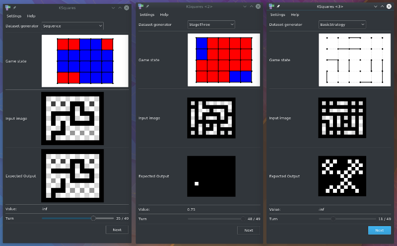

# KSquares - AlphaDots

KSquares is used for

* generating training data for [AlphaDots](AlphaDots.html)
* viewing training data
* evaluating trained models
* playing Dots and Boxes

## Setup

Please make sure to corectly configure AlphaDots in KSquares by entering the
Alpha Dots directory in KSquares -> Settings -> Configure KSquares -> Computer Player.

Clone this git repository to get Alpha Dots:
```
git clone https://gitlab.informatik.uni-bremen.de/ofenrohr/alphaDots.git
```

## Data generators

You can generate training data by running ksquares with certain command line 
arguments. To explore some of the datasets with a graphical user interface, run this:

```
ksquares --show-generate
```

You can only have one board size per dataset. Models can be trained on many datasets 
of different size.

All dataset generators accept the following optional command line arguments:

* `--dataset-dest` Destination directory for the data (.npz file)
* `--dataset-width` Board width in boxes
* `--dataset-height` Board height in boxes
* `--threads` Number of threads



### First Try

Converts random Dots and Boxes games played by the Hard AI to images.
One training example consists of two images: 

* The current state of the game in the input image
* The next line chosen by the Hard AI in the target image

All data is written to disk as actual .PNG images. 
Input and target images share the same sample UUID.

After generating the training data images, a python script needs to be run 
to convert the images to a numpy array. 

```
mkdir firstTryDataset
ksquares --generate 1000 --dataset-generator firstTry --dataset-dest firstTryDataset
../alphaDots/datasetConverter/convert.py --dataset-dir firstTryDataset --output-file firstTry.npz --debug
```


### Stage One

The input and target images are no longer generated as individual image files but
are sent directly to the python script instead. Communication is facilitated with
zeroMQ which is used to send images that were serialized with the protobuf library.

This dataset also introduces weak (random) moves so that there are examples of 
early captures. 10% of all samples end with a random move. The target image is always
made with the reaction of the Hard AI. Due to an oversight, the first version had a 
bug so that 90% of all samples were made with a random move. Models trained with the
buggy version include StageOne and AlphaZeroV1,V2,V3.

```
ksquares --generate 1000 --dataset-generator stageOne --dataset-dest /mnt/DATA/stageOneDataset --dataset-width 7 --dataset-height 5
```

### Basic Strategy

During the first phase of a Dots and Boxes game, there is a very large amount of 
acceptable lines. Usually the Hard AI just selects one of those many lines at
random. The trained neural network does not know that there are many alternatives
to the shown target image. This dataset aims to remedy this by putting all
viable lines in one target image.

```
ksquares --generate 1000 --dataset-generator basicStrategy --dataset-width 7 --dataset-height 5
```


### [Sequence](SequenceData.html)

Despite the efforts in *Basic Strategy*, the trained models were not able to compete
even with the Medium AI. The main innovation compared to the Easy AI is the ability
to count chains - i.e. only handing over the chain with the least amount of squares.
To do this, an AI needs to count the number of squares in each chain and decide
accordingly.

Previous datasets were used as training data for convolutional neural networks, which
lack the ability to count things. As a consequence, a new model is based on 
convolutional LSTM layers. That model needs another type of training data - only
the last state of the game is not enough, it also needs all states leading up to it.

This dataset is made of full Dots and Boxes games, played by two Hard AIs.

```
ksquares --generate 1000 --dataset-generator LSTM
```


### Training Sequence

This dataset is like the Sequence dataset but with "Basic Strategy" target images.

```
ksquares --generate 1000 --dataset-generator LSTM2
```

### Stage Two

The data is generated just like Stage One, but this dataset generator uses 
[cnpy](https://github.com/rogersce/cnpy) to directly write the .npz file. This removes
the overhead of sending the data to a separate, single-threaded python process. As a
result, this dataset generator can fully utilize the CPU and is much faster. 

```
ksquares --generate 1000 --dataset-generator StageTwo --threads 8
```

### Stage Three

Data is generated like in Stage Two and additionally offers a value output for
models like AlphaZeroV6 and up. The value is designed to approximate the chance 
of winning the game where 1 means winning and -1 means losing the game. It is
calculated by playing the game to its end and then evaluating the number of 
captured boxes for each side as follows:

```
value = (OwnBoxes - EnemyBoxes) / (0.8 * TotalBoxes)
```

Create a Stage Three dataset by running:

```
ksquares --generate 1000 --dataset-generator StageThree --threads 8
```

## Model evaluation

The are two options to evaluate the trained models. The first option uses the native 
KSquares Dots and Boxes engine and displays all games while the second option is
optimized for fast evaluation. In both cases, a selection of models will be evaluated
by playing against the KSquares AIs `Easy`, `Medium` and `Hard`. 


### Slow GUI evaluation

Start the slow, GUI based model evaluation with:

```
ksquares --model-evaluation
```

### Fast evaluation

Start the multi-threaded fast model evaluation with:

```
ksquares --fast-model-evaluation --threads 8
```

### Common arguments

Both evaluation modes support the following optional arguments:

* `--models MODELS` 
  By default, all models will be evaluated. If you are only interested in a specific
  subset, use this optional argument. You can get a list of all available models with `ksquares --model-list`
* `--dataset-width WIDTH` Board width measured in boxes.
* `--dataset-height HEIGHT` Board height measured in boxes.
* `--gpu` Allow the model server to use the GPU.

### Example results

All games are played on a 5x5 board. The 5x5 board size is reserved for evaluation. No model was ever trained on any dataset with 5x5 boards.

Model|Games|Wins vs. Easyin 100 games|Wins vs. Mediumin 100 games|Wins vs. Hardin 100 games|Errors|Ends with Double Dealing|Preemtive Sacrifices
---|---|---|---|---|---|---|---
FirstTry|300|1|0|0|0|0|0
StageOne 3x3|300|58|27|6|0|0|0
StageOne 5x5|300|0|1|0|0|0|0
BasicStrategy|300|55|27|7|0|0|0
AlphaZeroV1|300|82|80|35|0|0|0
AlphaZeroV3|300|79|94|50|0|0|0
AlphaZeroV5|300|90|75|45|0|0|0
AlphaZeroV7|300|96|80|46|0|0|0

### Screenshot


## AlphaZero MCTS

AlphaZero is an AI in KSquares that is built according to the [Alpha Zero paper](https://arxiv.org/abs/1712.01815)


