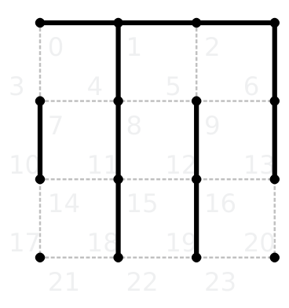

# Tests

This part describes the test suites in KSquares. The point of entry for all
tests is `ksquarestest` which incorporates various test suites. Each test
suite is a full QTest. You can pass command line arguments to the individual
QTest suites by putting them after a `--` argument. 
For example: `ksquarestest berlekamp -- -functions` will list all test 
functions in the `berlekamp` test suite.

By default all test suites are executed.

## Berlekamp

These tests are based on Elwin Berlekamp's book on Dots and Boxes.
You can run the tests by executing the following command in the cmake 
`build` directory:

```
ksquarestest berlekamp
```

### Berlekamp 001

The correct move is to create a long chain and not a cyclic chain so that the 
current player can gain control of the game.

```
Input:               Expected output:
+--+--+  +           +  +  +  +
|                              
+  +--+--+           +  +  +  +
|  |                           
+  +  +  +           +  +  +--+
   |     |                     
+  +--+  +           +  +  +  +
```

### Berlekamp 002

Either line of the two lines in expected output is fine, because in both cases
there will be two long chains. That is good for the current player because
the opponent will be forced to open one chain or the other.

```
Input:               Expected output:
+--+--+--+           +  +  +  +
   |     |                     
+  +  +  +           +  +  +  +
|  |  |  |                     
+  +  +  +           +  +  +  +
   |  |  |           |         
+  +  +  +           +--+  +  +
```

### Berlekamp 003

This test is almost identical to the previous test, but in this case the
situation calls for a preemtive sacrifice to win the game. By forfeiting
two boxex when there are still save lines left, the current player can win 
the game. In the next move, the opponent captures the two sacrificed boxes 
and ends the turn by drawing the bottom right line. After leaving a third 
box on the bottom left to the opponent, there will be no other choice but 
to open the long chain with six boxes.

```
Input:               Expected output:
+--+--+--+           +  +  +  +
   |     |                     
+  +  +  +           +--+  +  +
|  |  |  |                     
+  +  +  +           +  +  +  +
   |  |                        
+  +  +  +           +  +  +  +
```

### Berlekamp 004

```
Input:               Expected output:
+--+--+--+           +  +  +  +
|                              
+  +--+--+           +  +  +  +
   |     |                 |   
+  +  +  +           +  +  +  +
   |     |                     
+--+  +  +           +  +--+--+
```

### Berlekamp 005

```
Input:               Expected output:
+  +--+--+           +--+  +  +
|     |                        
+--+--+  +           +  +  +  +
|        |                     
+  +--+--+           +  +  +  +
|                              
+--+  +  +           +  +  +  +
```

### Berlekamp 006

```
Input:               Expected output:
+  +  +  +           +  +  +  +
   |  |                        
+  +  +--+           +--+  +  +
   |                 |         
+  +--+--+           +  +  +  +
|                          |   
+--+  +  +           +  +--+  +
```

### Berlekamp 007

```
Input:               Expected output:
+--+  +  +           +  +  +  +
|     |  |                     
+  +--+  +           +  +  +--+
|     |  |                     
+  +  +  +           +  +  +  +
      |                        
+  +  +  +           +  +  +  +
```

### Berlekamp 008

```
Input:                   Expected output:
+  +  +  +--+--+         +--+  +  +  +  +
|  |  |  |     |                         
+  +  +  +  +  +         +  +  +  +  +  +
|  |  |  |  |  |                         
+--+  +  +  +  +         +  +  +  +  +  +
|  |  |  |  |  |                         
+--+  +  +  +  +         +  +  +  +  +  +
```

### Berlekamp 009

```
Input:                   Expected output:
+  +  +  +--+--+         +--+  +  +  +  +
|  |  |        |                         
+  +  +--+--+  +         +  +  +  +  +  +
|  |  |        |                         
+--+  +  +--+--+         +  +  +  +  +  +
|  |  |                                  
+--+  +--+--+--+         +  +  +  +  +  +
```

### Berlekamp 010

```
Input:                   Expected output:
+  +  +  +--+--+         +  +  +  +  +  +
|  |  |        |                         
+  +  +--+--+  +         +--+  +  +  +  +
|  |  |        |                         
+--+  +  +--+--+         +  +  +  +  +  +
|  |  |                                  
+--+  +--+--+  +         +  +  +  +  +  +
```

### Berlekamp 011

```
Input:                   Expected output:
+--+--+  +--+  +         +  +  +--+  +  +
   |        |                            
+  +  +--+  +--+         +  +  +  +  +  +
|  |                                 |  |
+  +--+--+--+--+         +  +  +  +  +  +
|        |                               
+--+--+  +  +--+         +  +  +  +  +  +
|        |                               
+  +--+--+--+--+         +  +  +  +  +  +
|              |                         
+--+--+--+--+  +         +  +  +  +  +  +
```

### Berlekamp 012

```
Input:                   Expected output:
+--+--+--+--+--+         +  +  +  +  +  +
         |                               
+--+  +  +  +  +         +  +  +  +  +--+
|     |  |                               
+  +--+  +--+--+         +  +  +  +  +  +
   |     |     |                         
+--+  +--+  +  +         +  +  +  +  +  +
   |        |  |                         
+  +  +--+--+  +         +  +  +  +  +  +
   |  |        |                         
+  +  +  +--+--+         +  +  +  +  +  +
```

### Berlekamp 013

```
Input:                   Expected output:
+--+  +--+  +  +         +  +  +  +  +  +
      |     |                            
+--+  +  +--+  +         +  +  +  +  +  +
      |                     |            
+--+--+--+--+--+         +  +  +  +  +  +
   |           |                         
+  +  +--+--+  +         +  +  +  +  +  +
   |     |                               
+--+--+  +  +  +         +  +  +  +  +  +
         |     |                         
+  +  +  +  +  +         +  +  +  +  +  +
```

## AlphaZero

Execute the AlphaZero test suite by running the following command:

```
ksquarestest alphazero
```

### AlphaZero 001

This tests executes AlphaZero MCTS on Berlekamp 003. It was used to debug
the MCTS algorithm. The Monte-Carlo Tree was printed in dot-format to the 
`/tmp` directory. It was then converted to a png image with graphviz.

Take a look at the 
[example Monte-Carlo tree](AlphaZeroMCTS.png)
to get an impression. The first number in each node is the line number that
this node represents. All line numbers are displayed in the following image.

